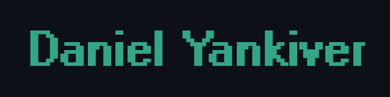

    

### About Me 
I am a creative software engineer with a background in Film and TV Production. I enjoy building applications that incorporate front-end and back-end development with robust UI that uses efficient code to solve real-world problems.

    
    
    
    

### Languages, Tools, and Skills

    
    
    
    
    
    
    
    
    
    
    
    
    
    
    
    
    
    
    
    
    
    
    
    
    
    
       

### GitHub Stats

    

---

### Currently Learning

- Docker
- Blockchain Development 
- web3.js

<!-- ---

 -->

