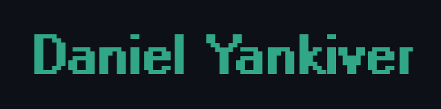

<!-- BANNER  -->

    

<!-- EMAIL & LINKEDIN --> 
<!-- 
 -->
    <!-- 
     
     -->
<!-- 
 -->

<!-- ### About Me -->

        Software engineer with a background in filmmaking. I build production apps across mobile and web, bringing a creative perspective to everything I ship. I leverage AI tools daily to accelerate development and output.
         
         
        

 
<h2>Skills: Languages, Frameworks, Libraries & Tools</h2>
 

    
    
    
    
    
    
    
    
    
    
    
    
    
    
    
    
    
    
    
    
    
    
    
    
    
    
    
    <!--      -->
    <!--      -->
    <!--      -->
    <!--      -->
    <!--      -->
    <!--      -->
    <!--      -->
    <!--      -->
    <!--      -->
    <!--      -->
    <!--      -->
    <!--      -->
    <!--      -->

<!-- <h2>GitHub Stats</h2>
 

     -->

<!--     <a href="https://github.com/danielyankiver"> -->
<!--          -->
<!--     </a> -->

---

<!-- <h2>Currently Learning</h2>

- SwiftUI
- Native Development
- Xcode -->
